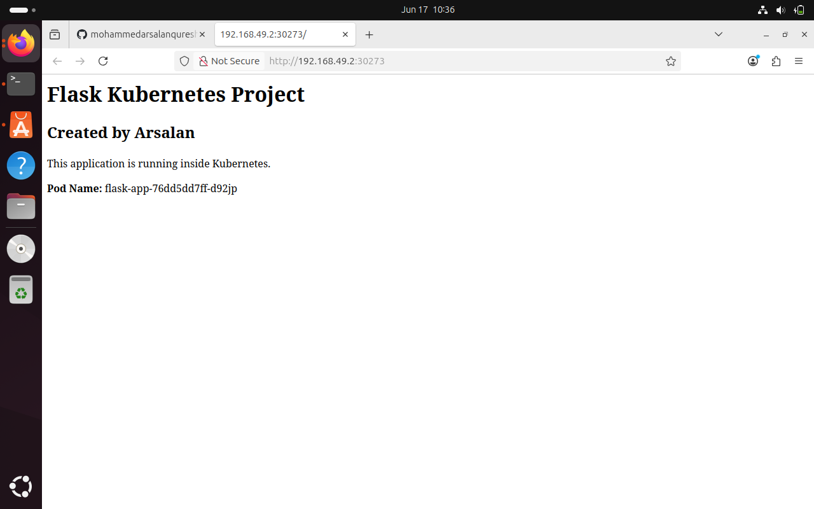
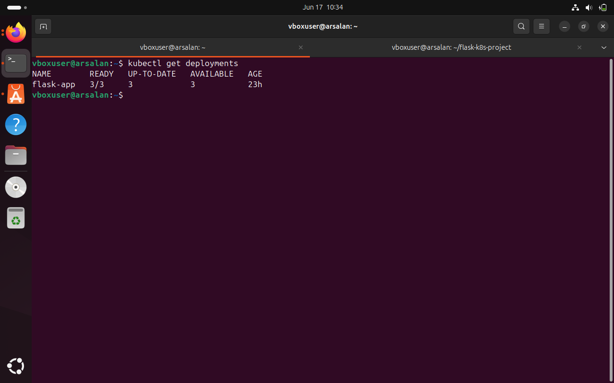

# Flask Kubernetes Project

## Overview

This project demonstrates the complete deployment lifecycle of a Flask application using Docker and Kubernetes.

The application is containerized using Docker, published to Docker Hub, and deployed on a Kubernetes cluster using Deployments and Services. Kubernetes manages multiple replicas of the application and automatically distributes traffic between Pods.

---

## Technologies Used

* Python
* Flask
* Docker
* Docker Hub
* Kubernetes (Minikube)
* YAML
* Git
* GitHub

---

## Project Architecture

```text
Flask Application
        │
        ▼
Docker Image
        │
        ▼
Docker Hub
        │
        ▼
Kubernetes Deployment
        │
        ▼
ReplicaSet
        │
        ▼
3 Flask Pods
        │
        ▼
Kubernetes Service (NodePort)
        │
        ▼
Browser
```

---

## Features

* Containerized Flask application using Docker
* Docker image published to Docker Hub
* Kubernetes Deployment with 3 replicas
* Self-healing through Kubernetes Deployments
* Load balancing using Kubernetes Service
* Pod hostname display for traffic distribution verification
* YAML-based Kubernetes configuration

---

## Project Structure

```text
flask-k8s-project/
├── app.py
├── requirements.txt
├── Dockerfile
├── deployment.yaml
├── service.yaml
├── README.md
└── .gitignore
```

---

## Docker Commands

Build Docker image:

```bash
docker build -t <dockerhub-username>/flask-k8s-project:v2 .
```

Push image to Docker Hub:

```bash
docker push <dockerhub-username>/flask-k8s-project:v2
```

Run locally:

```bash
docker run -d -p 5000:5000 <dockerhub-username>/flask-k8s-project:v2
```

---

## Kubernetes Deployment

Deploy application:

```bash
kubectl apply -f deployment.yaml
```

Create service:

```bash
kubectl apply -f service.yaml
```

Verify deployment:

```bash
kubectl get deployments
kubectl get pods
kubectl get svc
```

Access application:

```bash
minikube service flask-service
```

---

## Kubernetes Concepts Demonstrated

### Deployments

Used to manage application lifecycle and ensure the desired number of Pods remain running.

### ReplicaSets

Automatically created by the Deployment to maintain the specified replica count.

### Pods

Run the Flask application containers.

### Services

Provide a stable endpoint and distribute traffic across Pods.

### Load Balancing

Refreshing the application shows different Pod hostnames, demonstrating traffic distribution between replicas.

### Self-Healing

If a Pod is deleted, Kubernetes automatically creates a replacement Pod.

---

## Screenshots

### Application Running



### Kubernetes Pods


### Deployment Status



### Kubernetes Service


---

## Learning Outcomes

Through this project I learned:

* Docker image creation and management
* Docker Hub image publishing
* Kubernetes Deployments
* ReplicaSets and Pods
* Kubernetes Services
* Load Balancing
* Rolling Updates
* YAML configuration management
* Git and GitHub project management

---

## Author

Arsalan

Aspiring DevOps Engineer
