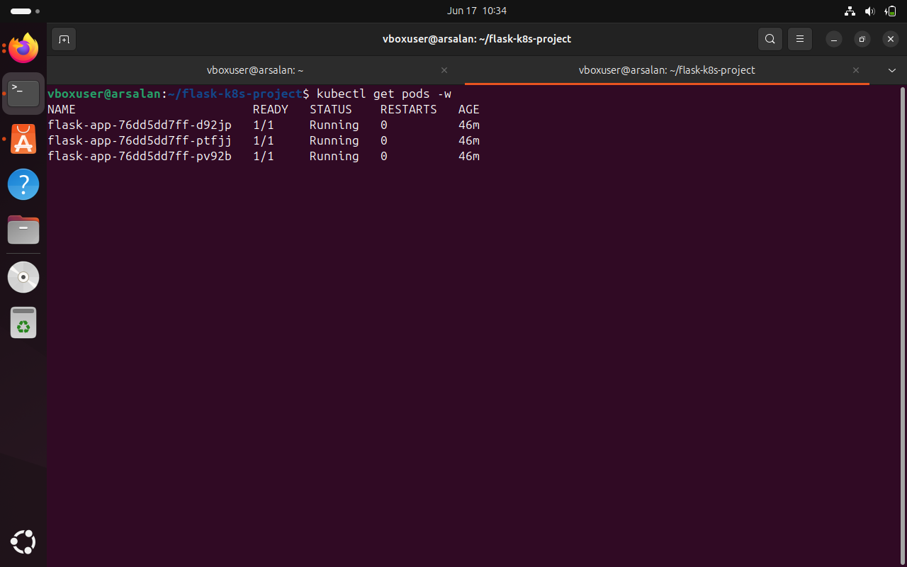
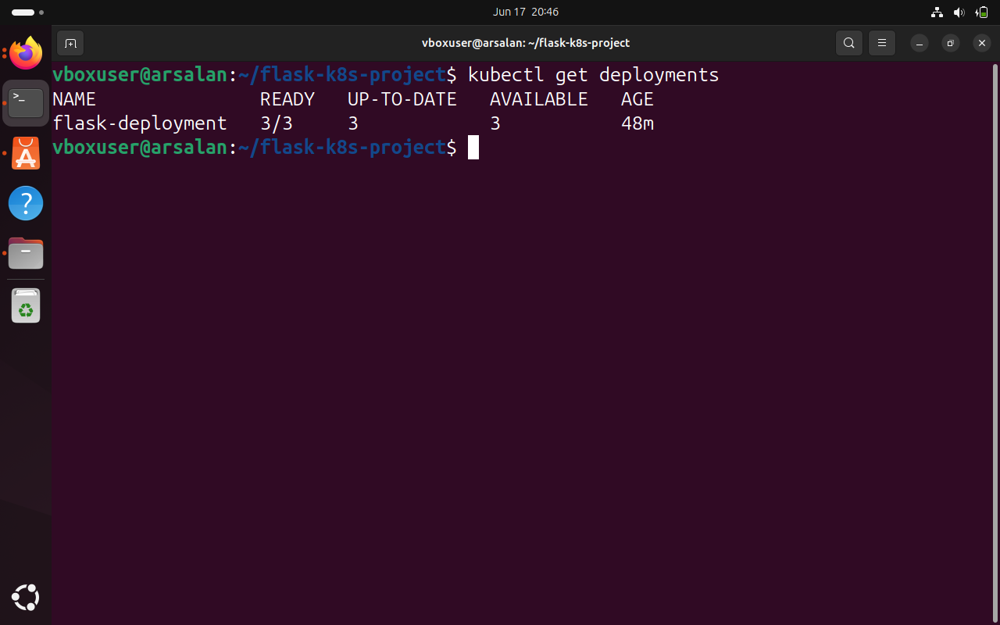
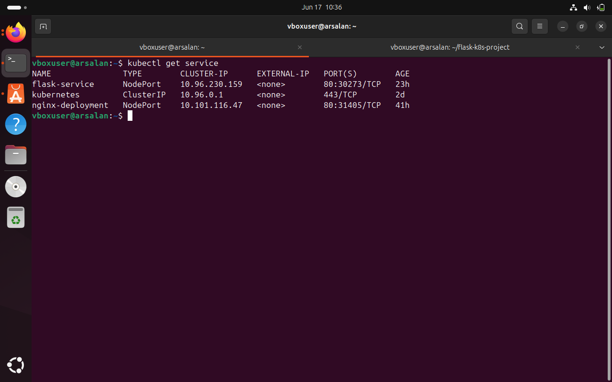
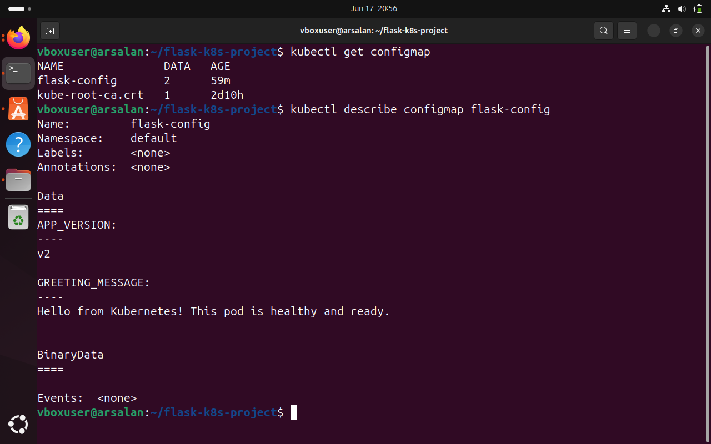
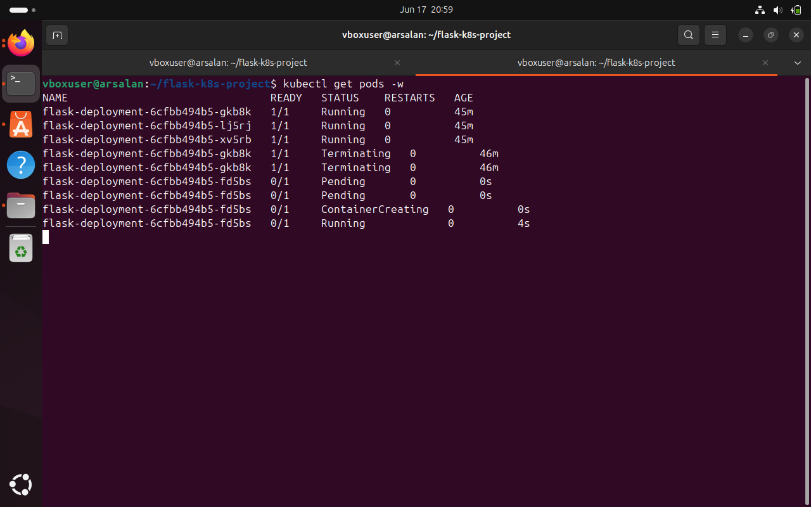

# Flask Kubernetes Project

## Overview
This project demonstrates the complete deployment lifecycle of a Flask application using Docker and Kubernetes.
The application is containerized using Docker, published to Docker Hub, and deployed on a Kubernetes cluster using Deployments, Services, and ConfigMaps. Kubernetes manages multiple replicas of the application, distributes traffic between Pods, enforces resource limits, and automatically recovers from failures using health probes.

---

## Why No CI/CD in This Project?
This project intentionally focuses on **Kubernetes orchestration fundamentals** — health checks, resource governance, and externalized configuration — rather than deployment automation. A dedicated CI/CD pipeline project (GitHub Actions building and deploying automatically on every push) is planned as a separate, focused project.

---

## Technologies Used
* Python
* Flask
* Docker
* Docker Hub
* Kubernetes (Minikube)
* YAML
* Git
* GitHub

---

## Project Architecture
```text
Flask Application
        │
        ▼
Docker Image
        │
        ▼
Docker Hub
        │
        ▼
Kubernetes Deployment
        │
        ▼
ReplicaSet
        │
        ▼
3 Flask Pods (with Liveness & Readiness Probes, Resource Limits)
        │
        ▼
Kubernetes Service (NodePort)
        │
        ▼
Browser
```

---

## Features
* Containerized Flask application using Docker
* Docker image published to Docker Hub
* Kubernetes Deployment with 3 replicas
* **Externalized configuration via ConfigMap** — app text/version injected as environment variables, no rebuild needed to change config
* **Liveness probes** — Kubernetes automatically restarts a Pod if the app becomes unresponsive
* **Readiness probes** — Pods are removed from traffic rotation if not ready, without being killed
* **Resource requests & limits** — CPU/memory governance to prevent a single Pod from starving the node
* Self-healing through Kubernetes Deployments
* Load balancing using Kubernetes Service
* Pod hostname display for traffic distribution verification
* YAML-based Kubernetes configuration

---

## Project Structure
```text
flask-k8s-project/
├── app.py
├── requirements.txt
├── Dockerfile
├── deployment.yaml
├── service.yaml
├── configmap.yaml
├── README.md
└── .gitignore
```

---

## Docker Commands
Build Docker image:
```bash
docker build -t arsalan87/flask-k8s-project:v2 .
```
Push image to Docker Hub:
```bash
docker push arsalan87/flask-k8s-project:v2
```
Run locally:
```bash
docker run -d -p 5000:5000 arsalan87/flask-k8s-project:v2
```

---

## Kubernetes Deployment

Apply the ConfigMap first (the Deployment references it by name):
```bash
kubectl apply -f configmap.yaml
```
Deploy application:
```bash
kubectl apply -f deployment.yaml
```
Create service:
```bash
kubectl apply -f service.yaml
```
Verify deployment:
```bash
kubectl get deployments
kubectl get pods
kubectl get svc
kubectl get configmap
```
Access application:
```bash
minikube service flask-service
```

---

## Kubernetes Concepts Demonstrated

### Deployments
Used to manage application lifecycle and ensure the desired number of Pods remain running.

### ReplicaSets
Automatically created by the Deployment to maintain the specified replica count.

### Pods
Run the Flask application containers.

### Services
Provide a stable endpoint and distribute traffic across Pods.

### ConfigMaps
Externalize application configuration (app version, greeting message) as environment variables, decoupling configuration from the container image. Changing a value only requires updating the ConfigMap and restarting the Deployment — no image rebuild.

### Liveness Probes
Periodically check whether the application is still responsive. If checks fail repeatedly, Kubernetes kills and restarts the container — this is what makes self-healing work for application-level hangs or crashes, not just manual Pod deletion.

### Readiness Probes
Check whether a Pod is ready to receive traffic. A failing readiness check removes the Pod from the Service's load-balancing rotation without restarting it — useful for slow startups or temporary overload.

### Resource Requests & Limits
`requests` define the guaranteed minimum CPU/memory reserved for scheduling; `limits` define the hard ceiling. Exceeding the memory limit triggers an OOMKill and restart; exceeding the CPU limit results in throttling. This prevents one Pod from starving others on the same node.

### Load Balancing
Refreshing the application shows different Pod hostnames, demonstrating traffic distribution between replicas.

### Self-Healing
If a Pod is deleted or fails its liveness probe, Kubernetes automatically creates a replacement Pod. Verified by manually deleting a Pod and observing Kubernetes recreate it automatically.

### Image Pull Policy
Using `imagePullPolicy: Always` ensures the cluster always pulls the latest image with a given tag from Docker Hub rather than relying on a locally cached version — important when iterating on the same tag during development.

---

## Debugging Notes (Real Issues Encountered)

* **Stale image after rebuild:** After rebuilding and pushing an updated image with the same tag, Kubernetes continued running the old code. Root cause: `imagePullPolicy` defaulted to `IfNotPresent`, so the cluster reused its locally cached image instead of pulling the new one. Fixed by setting `imagePullPolicy: Always` and running `kubectl rollout restart deployment`.
* **Duplicate Deployments after a rename:** Renaming the Deployment in `deployment.yaml` (from `flask-app` to `flask-deployment`) created a *new* Deployment object rather than renaming the existing one, leaving the old Deployment and its Pods running in parallel. Identified via `kubectl get deployments` and `kubectl get replicasets`, then resolved by explicitly deleting the orphaned Deployment.

---

## Screenshots
### Application Running

### Kubernetes Pods

### Deployment Status

### Kubernetes Service

### Pod Health Checks & Resource Limits

### ConfigMap

### Self-Healing Demonstration


---

## Learning Outcomes
Through this project I learned:
* Docker image creation and management
* Docker Hub image publishing
* Kubernetes Deployments, ReplicaSets, and Pods
* Kubernetes Services and load balancing
* Externalizing configuration using ConfigMaps
* Implementing liveness and readiness probes for production-style health checking
* Setting resource requests and limits for cluster resource governance
* Debugging real cluster issues: stale image caching and orphaned Deployments
* Git and GitHub project management

---

## Author
**Mohammed Arsalan Qureshi**
Aspiring DevOps Engineer
GitHub: [@mohammedarsalanqureshii-tech](https://github.com/mohammedarsalanqureshii-tech)
